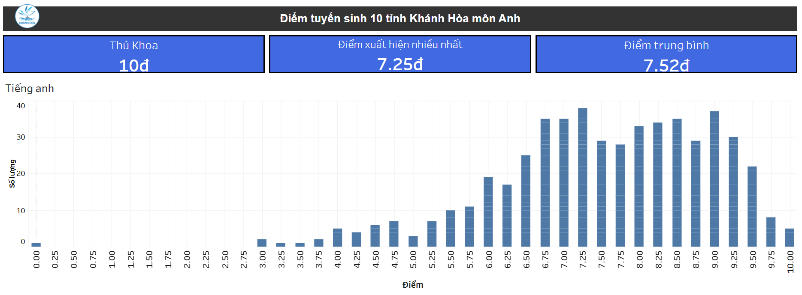
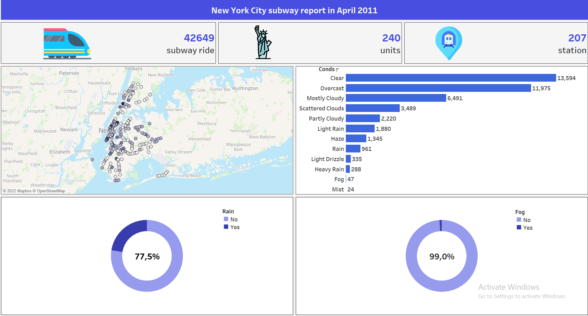
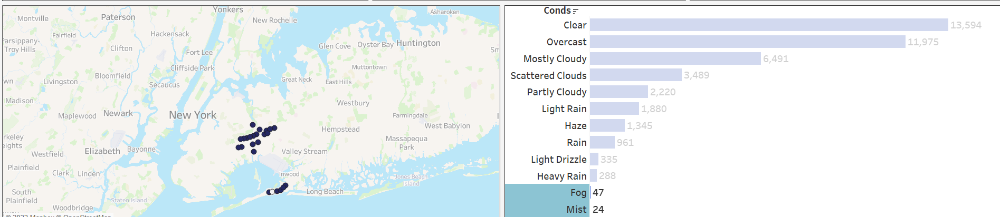

The detail of all the file related to the question are in the folder of that question, below is the detail explanation for each question.
---
### Note: Look in Q4 in the pdf file we see that the array start from 1 -> n. So Q4,Q5,Q6 I will assume that the array start from 1 -> n not 0 -> n - 1. To run Q6 you need to change input.txt as the linked list head.
---
### Q1
In this question we want to find the second highest score of athletes, firstly I try to use the ``` MAX``` statement but it only return the maximum score, so I think of the approve using the ``` WHERE``` statement to put in the condition that take the  highest score that is smaller than the maximum score.
```
SELECT MAX(Score) as second_highest_score
FROM Performance
WHERE Score < (SELECT MAX(Score) FROM Performance);
```
---
### Q2
In this question we want to report all customers who never order anything, we know that the **orders** table store the list of the customerId that have make at least one order. So the idea is to take every customerId in **customers** table that not appear in the **orders** table using ``` WHERE NOT IN ```.
```
SELECT *
FROM Customers C
WHERE C.id not in (SELECT O.customerId FROM Orders O);
```
---
### Q3
In this question we want to find the employees who are high earners in each of the departments.

First let consider a sub problem, how to find the global top three unique salaries, to solve this we use a function name ```DENSE_RANK()```. This function will return the rank of each row with no gap between them.

Next we want to find the top three unique salaries but for each department, if we use the ```GROUP``` statement for department, SQL will understand that the result also return as one group for each department but that not what we want. We want SQL to understand that it need to do the math for each department but the return result will not be group and SQL provide ```PARTITION``` statement to do that.

```
SELECT DISTINCT
    department,
    employeeId,
    employeeName,
    salary
FROM (
SELECT
    d.Name as department,
    e.id as employeeId,
    e.Name as employeeName,
    e.salary as salary,
    DENSE_RANK() OVER (PARTITION BY d.Name ORDER BY e.salary DESC) as rk
FROM employee as e
JOIN department as d
ON e.departmentId = d.id
    ) t1
WHERE rk <= 3
```
---
### Q4
We have the lemma

```0 + 1 + 2 + ... + n = n * (n + 1) / 2```


We also know that there is only one missing element from ```0``` to ```n```, so if we take ```n * (n + 1) / 2``` and subtract it with the sum of all the appeared  elements we will get the missing value.

```
long long sum = 0;
for(int i = 1 ; i <= n ; i++)
{
    long long val;
    cin >> val;
    sum += val;
}
cout << "The missing number is: " << n * (n + 1) / 2 - sum << endl;

```
---
### Q5
To find the median of two sorted, the easy way is to create a merged sorted array from the two sorted array. We can do that by using the **two pointer** technique.
```
int cnt = 0;
for(int i = 1 , j = 1 ; i <= m || j <= n ; i++){
    while(j <= n && (i > m || arrF[i] > arrS[j])){ // if the next element of the second array is smaller than the first array
        arrM[++cnt] = arrS[j]; // take j as the next element in the sorted array
        j++;
    }
    arrM[++cnt] = arrF[i]; // take i as the next element in the sorted array
}
```

After having a merge sorted array, the only thing left is to take care of the case the size ```sz``` of the array is odd or even .
```
int sz = n + m;
if(sz % 2 == 0)
    cout << (double)(arrM[sz / 2] + arrM[sz / 2 + 1]) / 2;
else
    cout << arrM[sz / 2 + 1];
```
---
### Q6
This problem is difficult to implement, but the idea is straight forward, we just need to loop from the start to the end of the linked list and check if the current value is equal to the next value, if yes we will delete the next value and link the current value to the next of the next value, else just loop to the next value. The trick here is to set the default value of the next node is ```NULL``` it will help us avoid many errors.
```
struct Node{
    int val;
    Node *next = NULL; // every next node will auto assign NULL value
};
```
```
void delDup(Node *&head)
{
    if(head == NULL)
        return;
    Node *p = head;
    if(p -> next == NULL) // if there is only 1 element
        return;

    while(p -> next != NULL) // while the next element is not NULL
    {
        if(p -> val == p -> next -> val) // check if the current value equal to the next value
        {
            Node *temp = p -> next; // temp equal to the next value
            p -> next = temp -> next; // assign the next of the next value to the current value, if it not exist p -> next will equal to NULL
            delete temp;
        }
        else // if delete the next value, no need to p to go to the next value
            p = p -> next;
    }
}
```
---
### Q7
First we need to design a score to measure how sensitive is a website, let call that ```sc```, the ```sc``` score is depending on many different scenario like if the company care about the product may be out of date, we can set something like ```sc = how many day the product expired```. Let assume that we already calculate ```sc``` now let create a solution to maintain this list of websites.

---
#### Solution 1
We will maintain an 1D sorted array ```arr``` of size ```1000``` in decreasing order of the ```sc``` score,  when there is a new website we will calculate the ```sc``` and loop throw the ```arr``` to find the position ```pos``` of the first website that is less sensitive then the current website, than insert the current website to the ```pos``` position to extend the list of website. If it get over ```1000``` website than delete the last website of the array ```arr``` or if ```pos``` is not exist than we ignore the new website.
##### Pro
Easy to implement.
##### Con
The overall complexity is ```O(N)``` which is acceptable because ```N = 1000```, but it is not fast enough to handle bigger ```N```.

---
#### Solution 2
Instead of maintain a 1D sorted array, we will maintain a min-heap. When there is a new website, if the min-heap size is less than ```1000``` than we will insert the new website, else we will compare the ```sc``` score of the new website with the top element of the min-heap, if the ```sc``` score of the new website is greater, we will pop the top element than insert the new website, else we just ignore the new website.

##### Pro
The overall complexity is ```O(log(N))```, harder to implement by hand but almost every language has a library that support pre-built heap. For example the ```STL``` library in ```C++```.
##### Con
We can only access the min element, to access random element ```i``` we need to pop all element of the current heap and maintain all the pop element in another heap. The complexity of random access is ```O(Nlog(N))```

---
### Q8
Although the exam score could have a lot of decimal, but the different between ```7.000``` and ```7.001``` is not much a different, so we could group them together into an interval plus we want to show the chart to the public so the chart must be easy to understand. That why I think the histogram graph is the best graph for this scenario.

Example




---
### Q9
We could use a naive solution like try every value from ```1 -> 6``` for all three dices than take all the cases that satisfy the sum of the first dice is greater than the two remaining dices. The complexity is ```O(N^3)``` with ```N = 6```

```
int res = 0;
for(int x = 1 ; x <= 6 ; x++) // first dice
    for(int y = 1 ; y <= 6 ; y++) // second dice
        for(int z = 1 ; z <= 6 ; z++) // third dice
            if(x > y + z) // if first dice greater than the sum of the remaining dice
                res += 1;
cout << "The naive solution result: " << res << "/" << 6 * 6 * 6  << "=" << (double)res / (6 * 6 * 6) << endl;
```
The optimize solution is to use **dynamic programming** to improve to ```O(N)```.

Let ```f[i][j]``` is the number of way to make the ```j``` dice score ```i``` point. Because the next dice could be from ```1 -> 6``` so  

```f[i][j] = f[i - 1][j - 1] + f[i - 2][j - 1] + ... + f[i - 6][j - 1]```

Let ```prefixSum[i][j]``` is the number of way to make ```j``` dice score from ```[0,i]``` point

``` prefixSum[i][j] = f[1][j] + f[2][j] + ... + f[i][j] = prefixSum[i - 1][j] + f[i][j]```

We have

``` f[i][j] = f[i - 1][j - 1] + f[i - 2][j - 1] + ... + f[i - 6][j - 1]```

```= (f[i - 1][j - 1] + f[i - 2][j - 1] + ... + f[1][j - 1]) - (f[i - 7][j - 1] + f[i - 8][j - 1] + ... + f[1][j - 1])```

```= prefixSum[i - 1][j - 1] - prefixSum[i - 7][j - 1] ```

```
f[0][0] = 1; // 0 dice so 0 score
prefixSum[0][0] = 1;
for(int i = 1 ; i <= 6 ; i++)
     prefixSum[i][0] = prefixSum[i - 1][0] + f[i][0];

for(int j = 1 ; j <= 2 ; j++){
    for(int i = 1 ; i <= 6 ; i++){
        f[i][j] = prefixSum[i - 1][j - 1];
        if(i >= 7)
            f[i][j] -= prefixSum[i - 7][j - 1];
        prefixSum[i][j] = prefixSum[i - 1][j] + f[i][j];
    }
}

// calculate the result
int res = 0;
for(int i = 1 ; i <= 6 ; i++)
    res += prefixSum[i - 1][2]; // result plus the number of way to make two dice score point greater than i

cout << "The optimize result: " << res << "/" << 6 * 6 * 6  << "="  << (double)res / (6 * 6 * 6) << endl;
```

   
**The result is:** ```20 / 216 = 0.0925926```

---
### Q10


The New York City subway in **April 2011** had record **42649** subway train with **240** different units across **207** station. Most of the train start when the weather condition is **clear**, **overcast** or **mostly cloudy**. About **77,5%** of the train start when there **no rain** and **99%** when there is **no fog**. 


The interesting thing I found is that only the **south east station** of the New York City had subway train when the condition is **fog** or **mist**, my hypothesis is because of the **rolling topography** and **varying climate** make it particularly prone to **fog** and **mist**.
